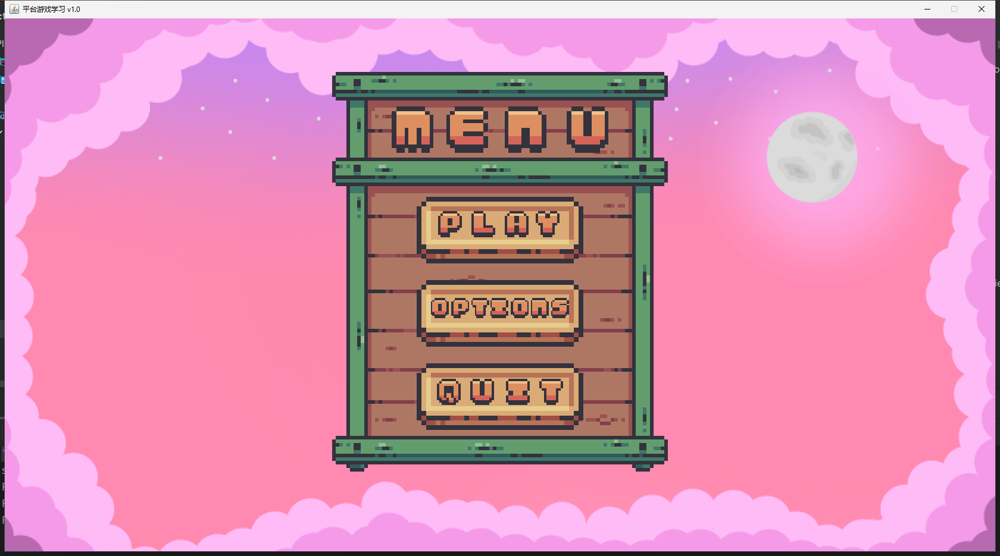
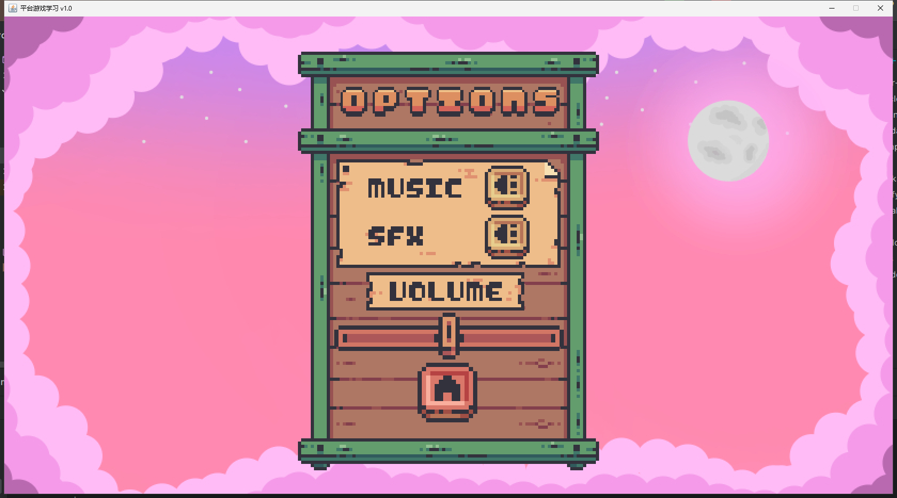
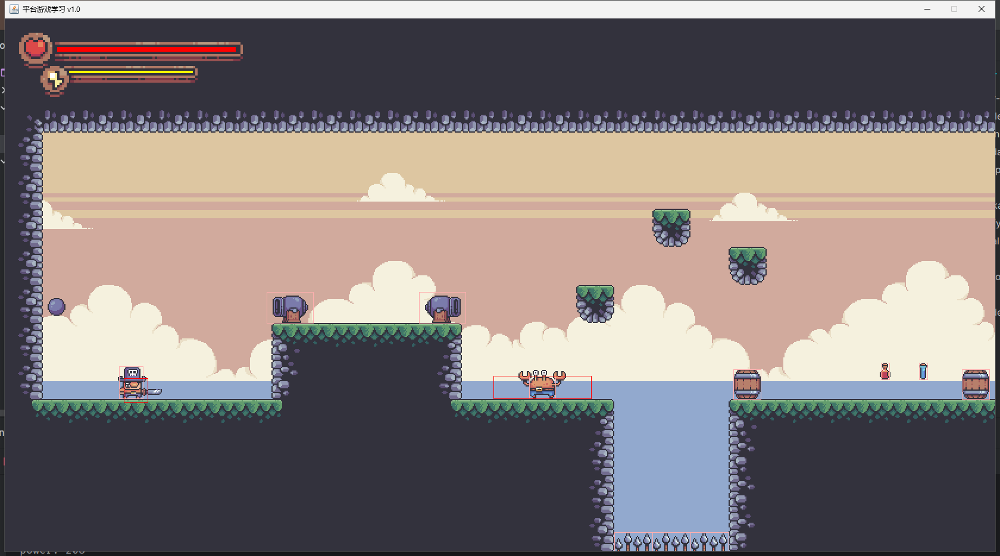
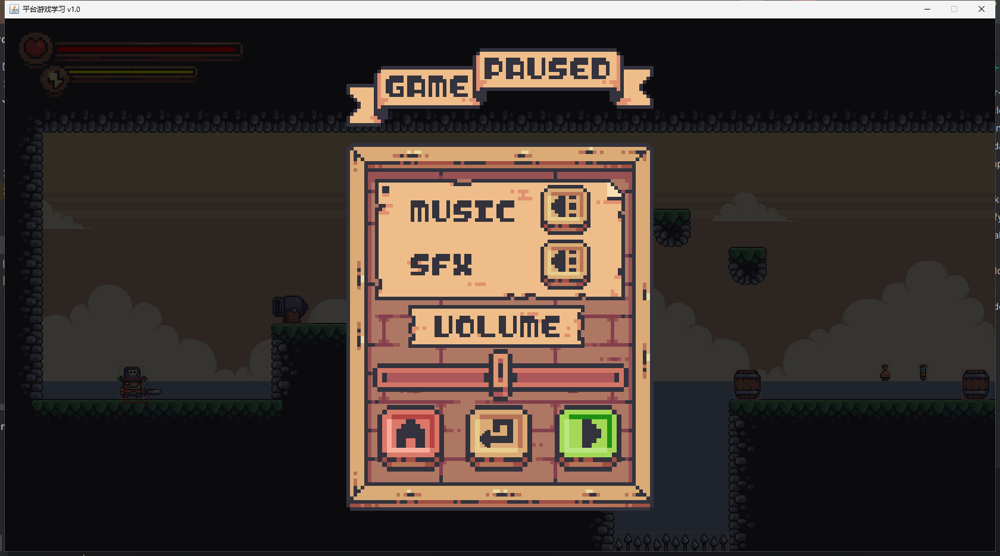

# 简介

本项目是学习平台2D游戏开发创建的，基于 Java Swing 技术开发。

参考视频：

[基于Swing的2D平台游戏开发教学视频](https://www.youtube.com/watch?v=6_N8QZ47toY&list=PL4rzdwizLaxYmltJQRjq18a9gsSyEQQ-0&index=1)

# 界面

开始界面

选项界面

第一关界面

暂停界面
